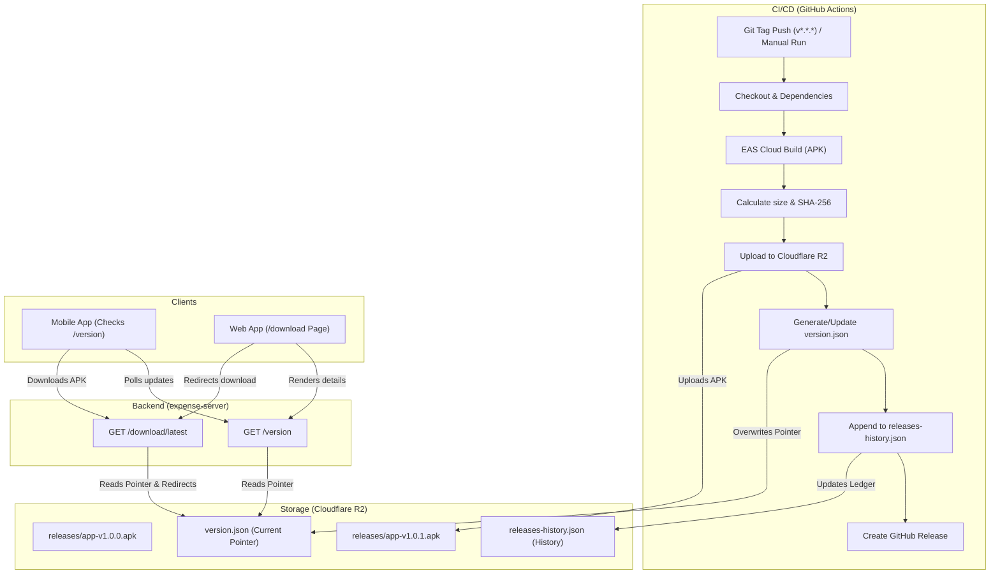

# Standalone APK Distribution Pipeline Documentation

This document describes the architecture, setup steps, release workflows, and rollback procedures for the SplitShare standalone APK distribution system.

---

## 1. System Architecture

The following diagram illustrates how a code change travels from a developer's machine to the user's mobile device as an automated, version-controlled update.



---

## 2. Setup Guide

### Step 1: Create the Cloudflare R2 Bucket

1. Log in to your **Cloudflare Dashboard**.
2. Navigate to **R2 Object Storage** → **Create Bucket**.
3. Set the Bucket Name to `expense-releases` (or a custom name).
4. Go to the **Settings** tab of the created bucket:
   - Under **Public Access**, click **Allow Access**.
   - Note the **Public URL** (e.g., `https://pub-xxxx.r2.dev`). This will be your S3-compatible download base URL.

### Step 2: Configure S3 API Credentials

To allow GitHub Actions to upload files:

1. Go to **R2 Object Storage** → **Manage R2 API Tokens**.
2. Click **Create API Token**:
   - Name: `github-actions-releases`
   - Permissions: **Admin Read & Write** (required to put objects and list).
   - Scope: Restrict to your `expense-releases` bucket.
3. Click **Create Token** and copy the credentials:
   - **Access Key ID**
   - **Secret Access Key**
   - **Endpoint URL** (use `https://<ACCOUNT_ID>.r2.cloudflarestorage.com`)

### Step 3: Configure GitHub Secrets

Go to your GitHub Repository Settings → **Secrets and variables** → **Actions** and add the following repository secrets:

| Secret Name            | Description                                   | Example                   |
| ---------------------- | --------------------------------------------- | ------------------------- |
| `EXPO_TOKEN`           | Auth token generated from Expo CLI or account | `expo_xxxx...`            |
| `R2_ACCESS_KEY_ID`     | Access Key ID from Cloudflare API Token       | `6f38...`                 |
| `R2_SECRET_ACCESS_KEY` | Secret Access Key from Cloudflare API Token   | `a90b...`                 |
| `R2_ACCOUNT_ID`        | Cloudflare Account ID                         | `bf32...`                 |
| `R2_BUCKET_NAME`       | Name of your R2 Bucket                        | `expense-releases`        |
| `R2_PUBLIC_URL`        | Public URL for downloading R2 assets          | `https://pub-xxxx.r2.dev` |

### Step 4: Initialize EAS Project

1. Install EAS CLI: `npm install -g eas-cli`
2. Log in to your Expo account: `eas login`
3. Run `eas project:init` inside `apps/mobile` to link your codebase to your Expo dashboard.

---

## 3. Release Workflows

You can release updates in two ways:

### Method A: Git Tags (Recommended for Production)

Pushing a semantic version tag triggers a build automatically.

```bash
git tag v1.0.1
git push origin v1.0.1
```

_The pipeline will extract version `1.0.1` from the tag name, build, calculate metadata, upload to R2, and create a GitHub Release._

### Method B: Manual Trigger (Recommended for Emergency Fixes / Custom Notes)

1. Navigate to your repository on GitHub.
2. Go to **Actions** → **Release APK** workflow.
3. Click **Run workflow** and fill in the parameters:
   - **Version**: E.g., `1.0.2`
   - **Release Notes**: Describe the changes (markdown supported).
   - **Force Update**: Check this if it is a mandatory security/database fix.

---

## 4. Rollback Procedures

Old APK versions in R2 are **never overwritten or deleted**. This makes rollbacks instant and safe without rebuilding code.

### Step-by-Step Rollback

1. Log in to Cloudflare Dashboard → R2 → select your bucket.
2. Locate `version.json` and download it.
3. Edit the file to point back to the previous stable release. For example, to rollback from `1.0.2` to `1.0.1`:
   ```json
   {
     "version": "1.0.1",
     "buildNumber": 2,
     "forceUpdate": false,
     "minVersion": "1.0.0",
     "apkUrl": "https://pub-xxxx.r2.dev/releases/app-v1.0.1.apk",
     "apkSizeBytes": 45102030,
     "sha256": "stable-sha256-checksum...",
     "releaseNotes": ["Rolled back to stable version v1.0.1 due to issues in v1.0.2."],
     "releasedAt": "2026-07-04T12:00:00Z"
   }
   ```
4. Upload the modified `version.json` back to R2, overwriting the existing one.
5. **Result**: Both the mobile app's auto-checker and the web download page will immediately recognize `1.0.1` as the latest version and download the corresponding stable APK.

---

## 5. Troubleshooting Guide

### Mobile App is not showing the Update Dialog

- **Development Mode**: The update check is disabled in development (`__DEV__ === true`) to prevent modal overlays during coding.
- **Cache**: React Query caches version checks for 30 minutes. Navigate out of the app and back to force a foreground focus refetch.
- **Console Logs**: Run your server locally and call `curl http://localhost:4000/version/health` to confirm the R2 connection is active.

### GitHub Actions Fails on S3 Connection

- Double check that your `R2_ACCOUNT_ID` is correct. The S3 endpoint URL must be formed exactly as `https://<R2_ACCOUNT_ID>.r2.cloudflarestorage.com`.
- Verify the API Token permissions. It must have **Read & Write** access to the specific bucket.

### EAS Build Fails on Keystore

- If EAS complains about missing credentials, run `eas credentials` inside `apps/mobile` and follow the prompts to let EAS generate and manage Android Keystore credentials securely.
